# 🚀 Creando una ONE Page con WordPress 🌐

### 📝 Guía paso a paso para crear una **One Page** con WordPress

**Instructor:** Santi Molina - Argentina 🇦🇷  
**Talleres:** Don Web 🖥️

---

## 🌟 ¿Qué es una One Page con WordPress? 

Una **One Page** es un sitio web donde todo el contenido está concentrado en una sola página, creando una experiencia fluida para el usuario sin la necesidad de navegar entre diferentes secciones.

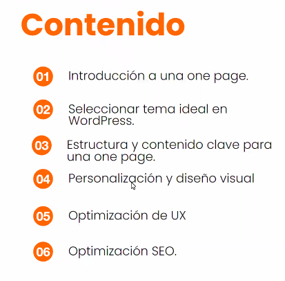

---

## 🎯 Introducción

El objetivo de una **One Page** es **retener al usuario** y presentar información de manera concisa y directa. No es una simple *landing page*, sino que busca dar una imagen más **institucional**.

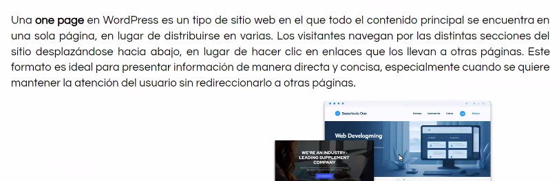

### 📑 Tipos de One Page:
- **Institucionales** 🏢
- **Comerciales** 🛍️

🔍 **¿Qué busca?**
- Información concentrada 💡
- Evitar aburrir al usuario 😴

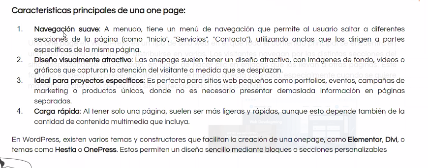

👉 **Todo está pensado para el móvil 📱**, ya que hoy en día gran parte del tráfico web proviene de dispositivos móviles.

---

## 🎨 Personalización y Diseño Visual

En una **One Page** puedes encontrar una variedad de temas, desde:
- **Gratis** 🆓
- **Pagos** 💰
- **Premium** 🏆

> 🔍 **Consejo:** Optimiza las imágenes para que pesen entre **200 y 300kb**. Esto mejora la carga de la página y la experiencia del usuario. 

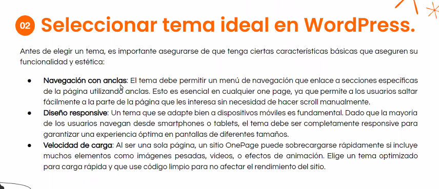

---

## 🛠️ Personalización

A la hora de mostrar proyectos propios o trabajos realizados, lo recomendable es incluir entre **6 a 9 proyectos** como máximo para mantener la atención del usuario sin sobrecargar la página.

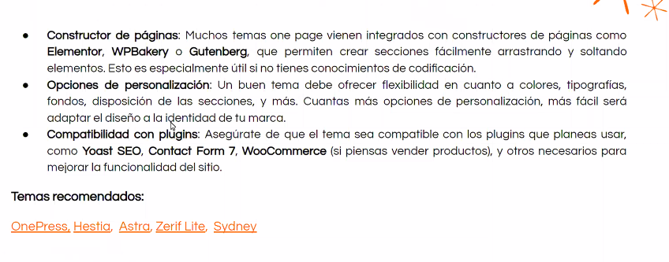
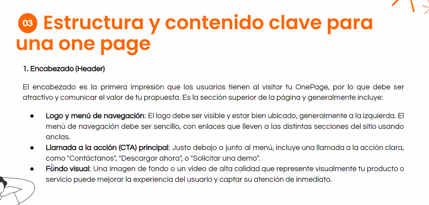
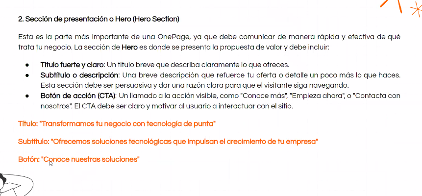
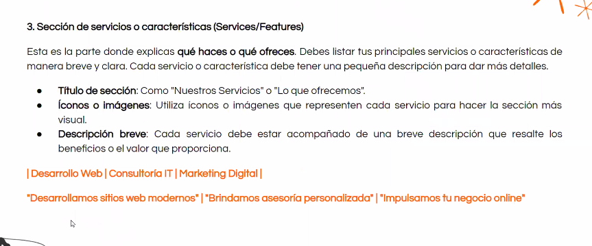
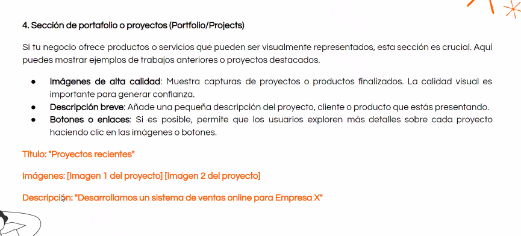

---

## 🖼️ Ejemplo de proyectos propios

Es recomendable que los proyectos mostrados en la página estén bien organizados y optimizados para la mejor experiencia.

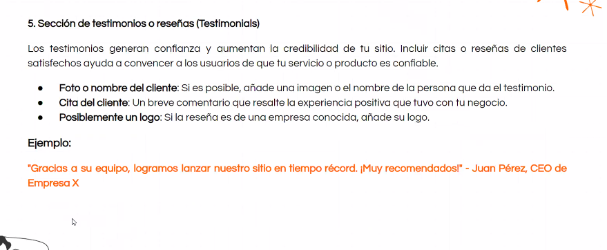

---

## 🤖 Chat y Bots

Hoy en día es común utilizar un **chat** o **bot** en el sitio, además del clásico formulario de contacto para mejorar la interacción con los usuarios.

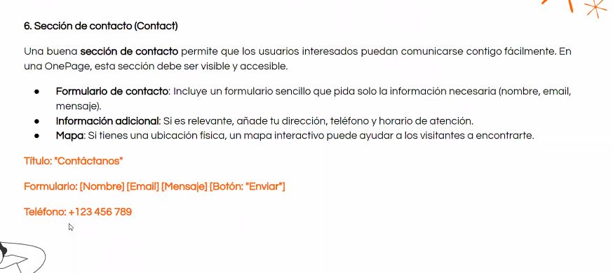

---

## 🎨 Temas y Apariencia

La apariencia es clave. Existen muchos **temas** disponibles para personalizar el diseño de tu One Page. Algunos son:
- Gratuitos 🎁
- Pagos 💳
- Premium 🌟

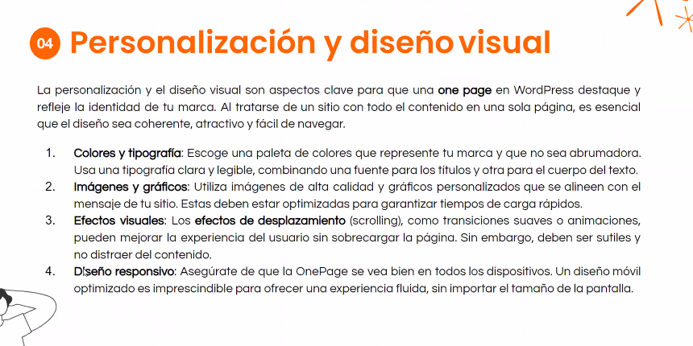

Una vez elegido el tema, ¡es hora de **activarlo**!

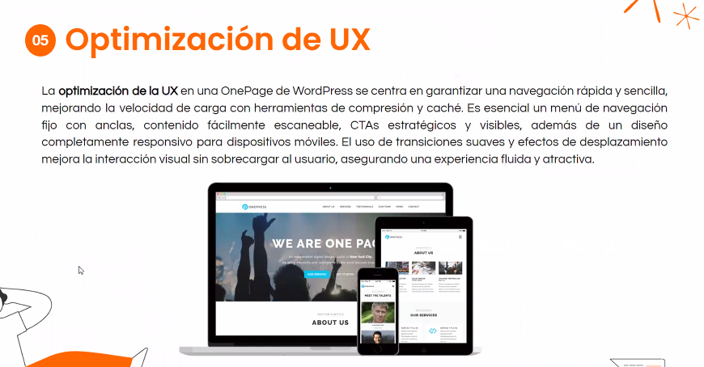
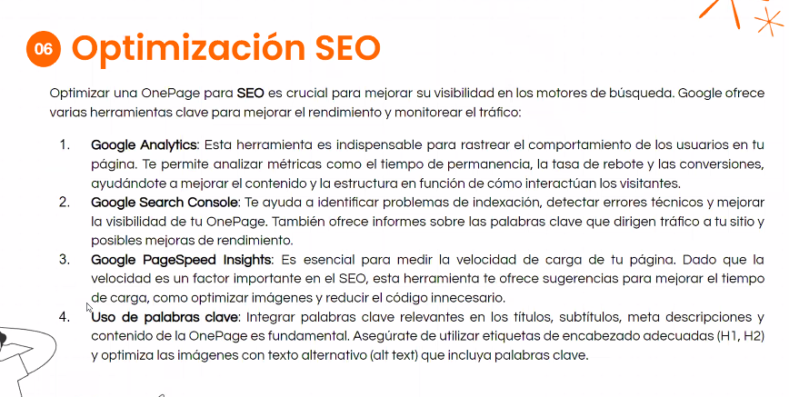

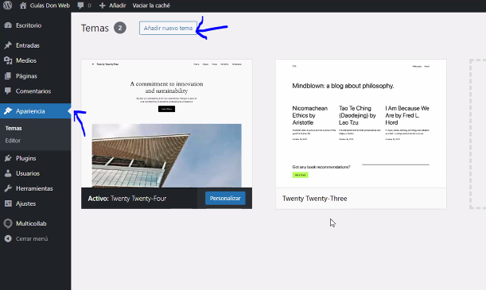
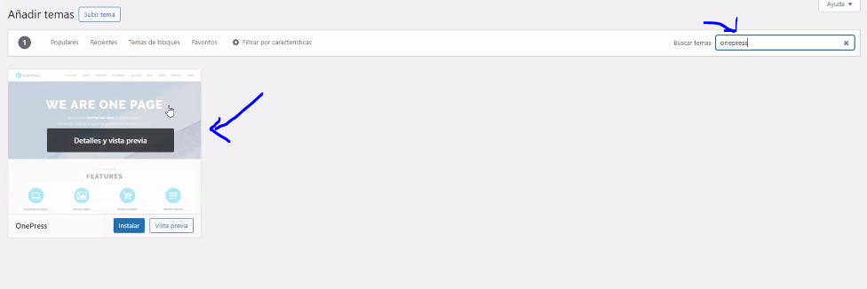
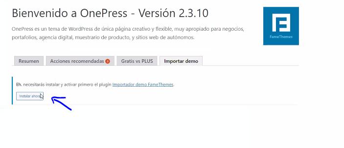
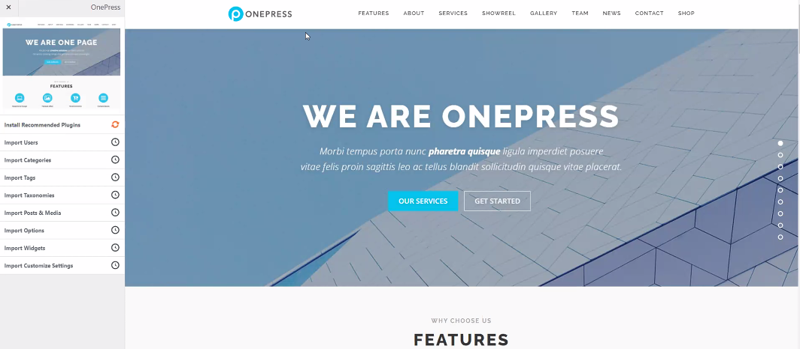
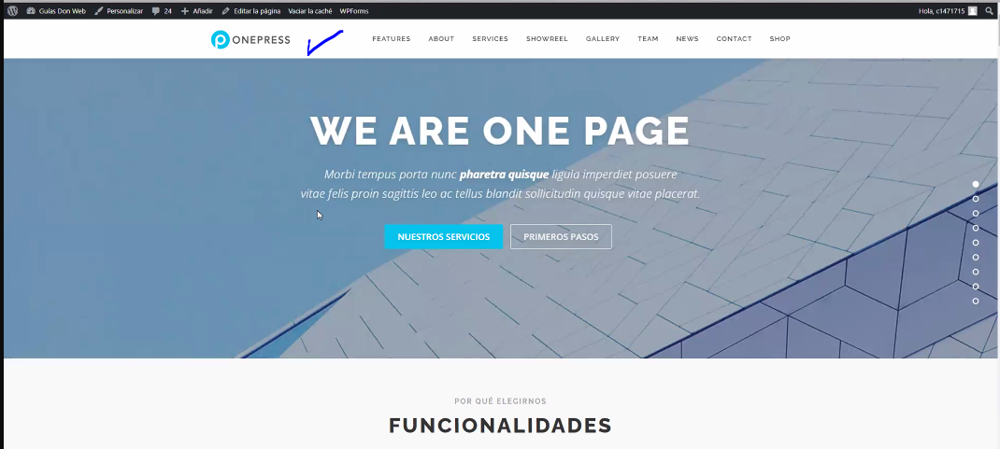
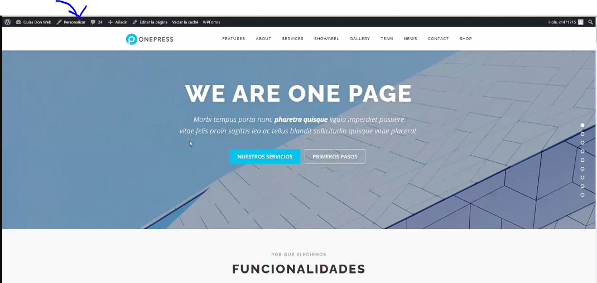

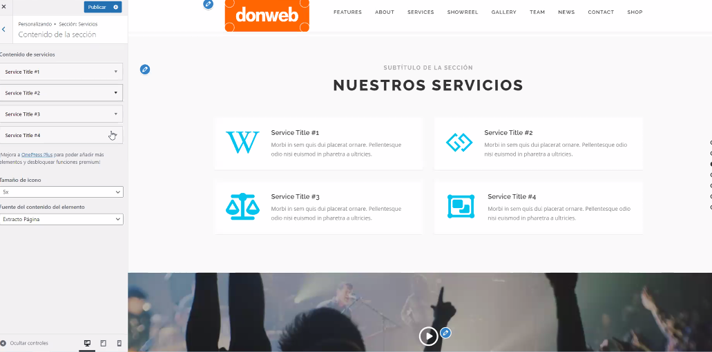
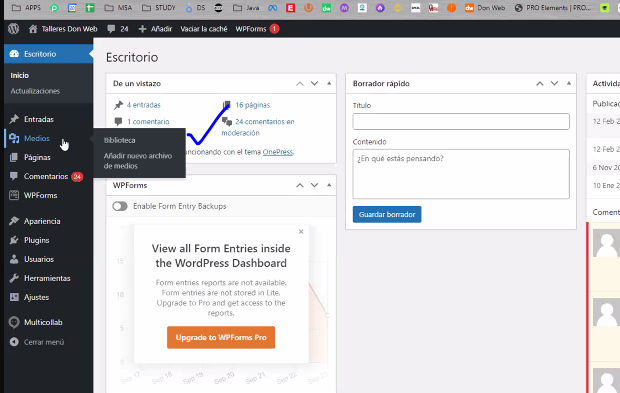

---

## 🎯 Conclusión

Crear una **One Page** con **WordPress** te permite tener un sitio web moderno, centrado en la **experiencia del usuario** y optimizado para dispositivos móviles. Recuerda siempre:
- Elegir un buen tema 🎨
- Optimizar tus imágenes 📸
- Incluir herramientas interactivas como **chats** y **bots** 💬

---

¡Sigue estos pasos y crea una **One Page** espectacular para tu proyecto! 🚀
