# Creando-una-landpage-con-wordpress
Guia paso a paso para crear una landigpage con wordpress

Instructor: Santi Molina
Talleres Don Web

## One page con wordpress

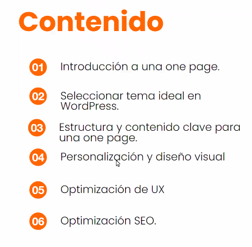

## Introduccion

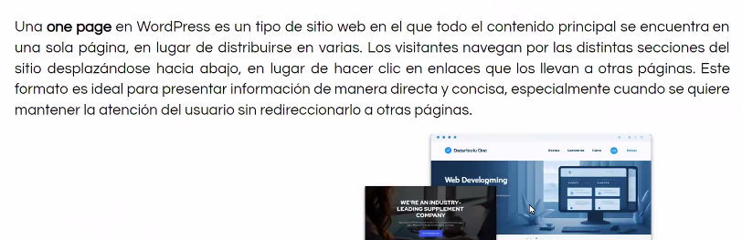

tipos:

- Institucionales
- Comerciales

busca retencion del usuario, 
One page no es una landing page

su objetivo es mas institucional

- info concentrada, 
- busca no aburrir

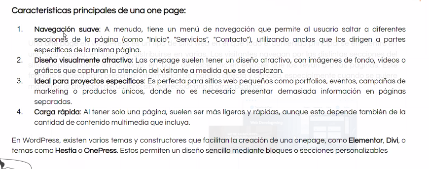

- todo va a lo movil
-

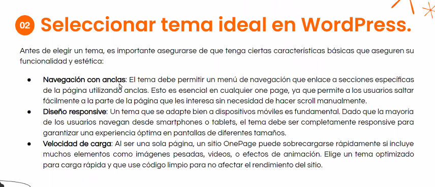

- hay temas gratis
- pagos
- y premiun

imagenes maximo 200 a 300kb en las paginas, por optimizacion

personalizacion

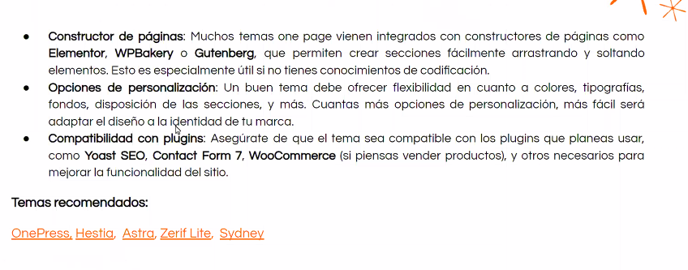

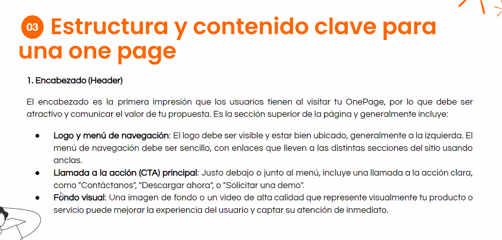

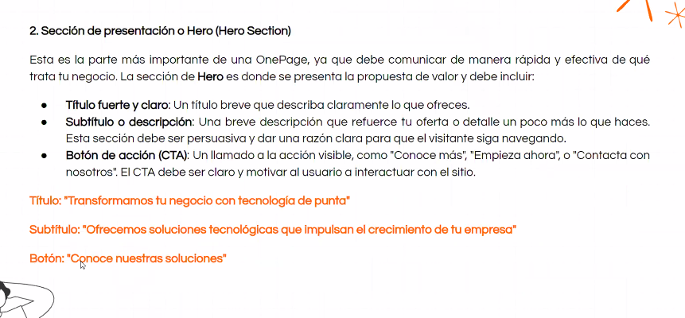

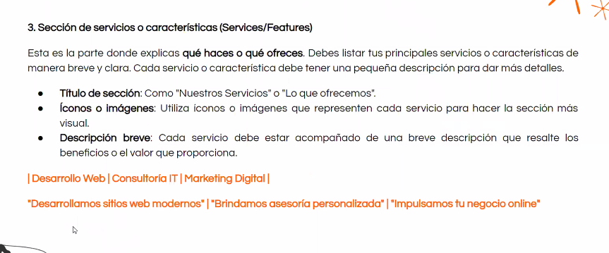

de 6 a 9 proyectos maximo de muestra en los proyectos propoios o trabajos

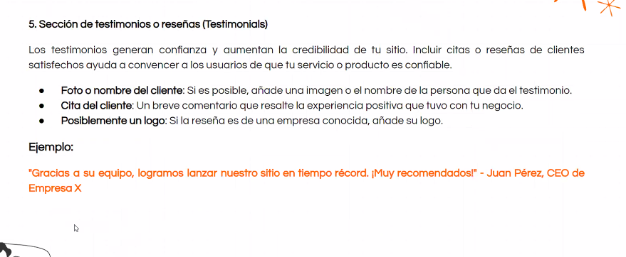

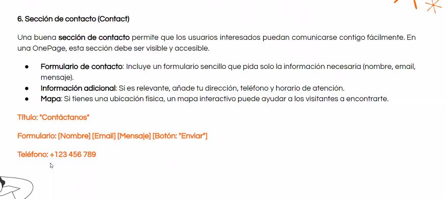

- hoy se usa el chat, un bot ademas del formulario

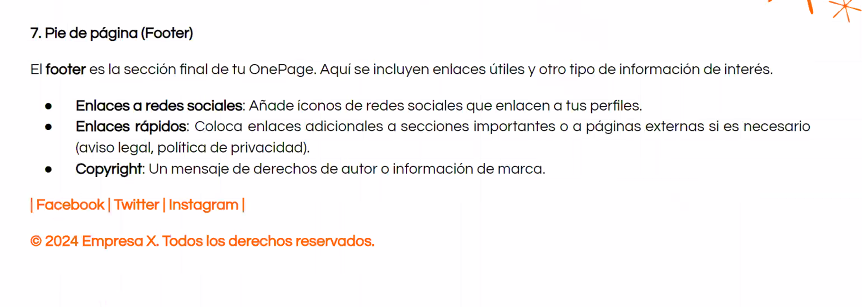

## 4. Personalizacion y diseño visual

## 5.

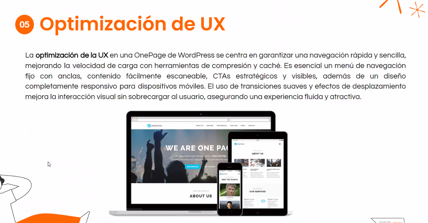

